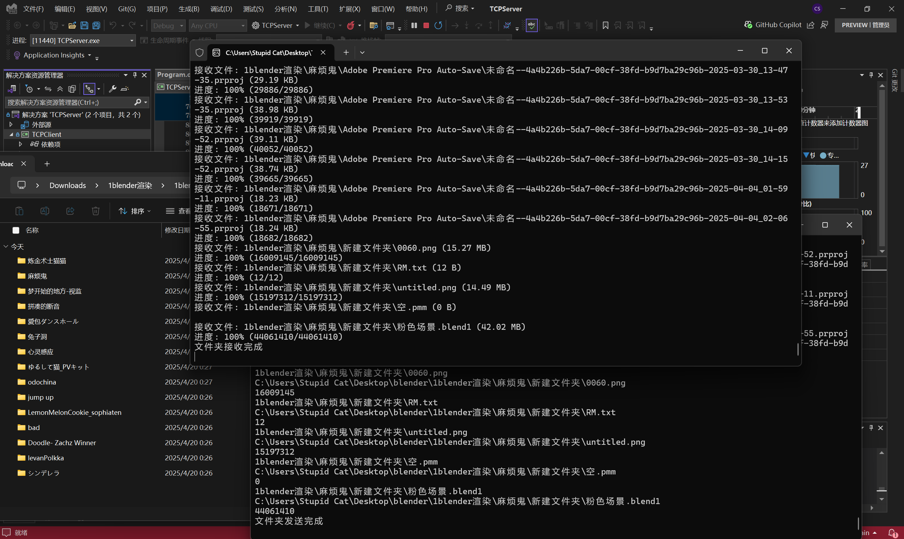

# TCPTransfer 网络传输
You can rely on TCP to transfer folders or files, although it is not secure. But it's very interesting. The part of transferring folders took me a long time, and in the end, Deepseek optimized my code

Fill in the information according to the instructions above (for development convenience, I directly filled in IP: 127.0.0.1, port: 14514)

Simply right-click on the file or folder and copy the local address, and it will be automatically processed (even with double quotes)

The client will download to the local Download folder

Program output or comments in Chinese

你可以依靠TCP来传输文件夹或文件，尽管它并不安全。但这很有趣。传输文件夹的部分花了我很长时间，最后，Deepseek优化了我的代码

按照上面的说明填写信息

只需右键单击文件或文件夹并复制本地地址，它就会自动处理（即使有双引号）

客户端将下载到本地下载文件夹

程序输出或注释为中文

